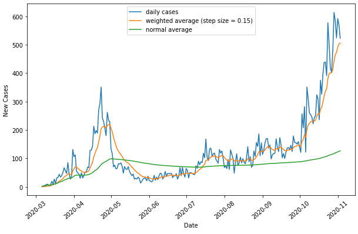

# Alberta COVID-19 Tracking Repository

 A small personal project currently undergoing active development. The focus of this project is to scrape data from Alberta Health Srvices, apply different visualization/analysis techniques to what data is obtained, and attempt to deploy it using ReactJS.

 Required Packages:
 - python packages in `requirements.txt`
 - requires [chromedriver](https://chromedriver.chromium.org/) to be in PATH or in directory for web scraping

## Table of Contents
1. Web Scraping with Python
2. Visualization and Prediction with Jupyter
3. Deployment with ReactJS

I am currently working on step 2.

## Web Scraping with Python
A simple python scraping script was built with the selenium package and chromedriver. Running `scrape.py` will automatically acces the [AHS website](https://www.alberta.ca/stats/covid-19-alberta-statistics.htm) and download the latest csv files to the local `info/` directory. Two CSV files will be downloaded. The first lists all cases ever recorde by AHS, while the second gives the current status for all regions in Alberta (Calgary, Edmonton, Counties, etc.).

 

*Improvements to be made:*
- Currently the script waits for a static amount of time for the page to load. Improvements could be made by detecting when the page is fully loaded before continuing.
- Using a library such as BeautifulSoup to also store the most recent date the database was updated.

## Visualization

**Mean**:
Taking the daily mean using a step size of (1/n). This is the same calculated result as (sum of cases)/(# of days), with a very minor improvement in efficiency as you do not need to recalculate the sum for each new day.

**Weighted Average**:
Taking the weighted average using a constant step size. More "recent" days in calculation are weighed more heavily depending on the exact step size.

----

Linear: β0 + β1t

Quadratic: β0 + β1t + β2t2

**Linear and Quadratic Curve Fitting**:
It is clear that both linear and quadratic models are not sufficient to model the growth of cases per day in Alberta. It's interesting to note how the most recent increase is faster than our modelled quadratic curve though.

Cubic = β0 + β1t + β2t2 + β3t3

Quartic = β0 + β1t + β2t2 + β3t3 + β4t4

**Cubic and Quartic Curve Fitting**:
Once we increase the degree of the polynomial model, it becomes much more accurate. Once we go past 3, the curve essentially becomes the same.

 

*Improvements to be made:*
- Planning to use more complex algorithms for future projects, including applications of reinforcement learning algorithms.

## Sources
Reinforcement Learning Algorithms:

Sutton, R. S., Bach, F., &amp; Barto, A. G. (2018). Reinforcement Learning: An Introduction. Massachusetts: MIT Press.

 

Monte Carlo Simulations:

Xie, G. A novel Monte Carlo simulation procedure for modelling COVID-19 spread over time. Sci Rep 10, 13120 (2020). https://doi.org/10.1038/s41598-020-70091-1